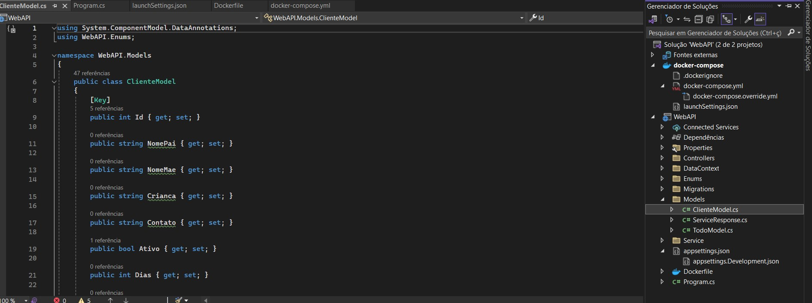
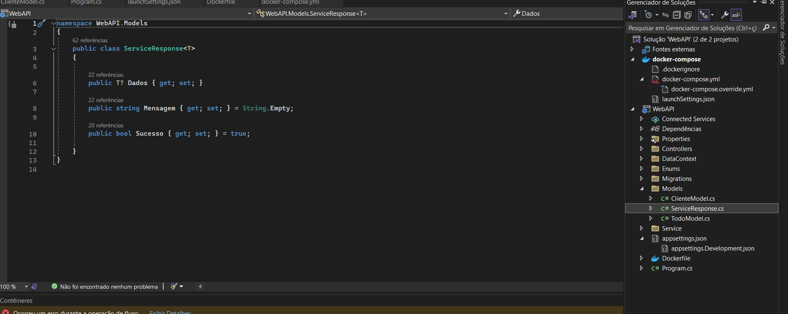
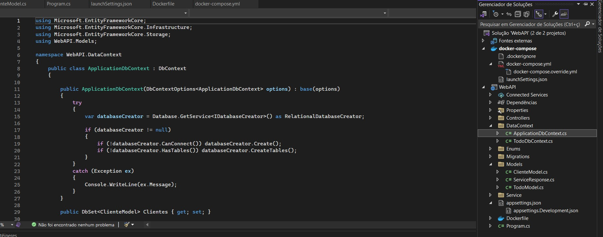

# zullen-fullstack-project
<h3>Projeto Fullstack para um contraturno escolar feito em .NET, Angular e, posteriormente, em Blazor. (repositório privado)</h3>

Primeiramente, busquei ver as necessidades da usuária do sistema e quais informações seriam mais relevantes para armazenar. Com isso, pude definir meu Modelo/Classe/Entidade e suas propriedades.

Segui o modelo de uma Classe "Resposta de Serviço" no qual este dados seriam inseridos numa propriedade "Dados", acompanhados de uma descrição booleana "Sucesso" para indicar o status das operações e os detalhes em uma string "Mensagem". 

Com os Modelos definidos, criei o Contexto do Banco de Dados usando o Entity Framework, configurei a conexão com o Banco de Dados no appsettings.json adicionando os devidos serviços em Program.cs e realizei as migrações.

