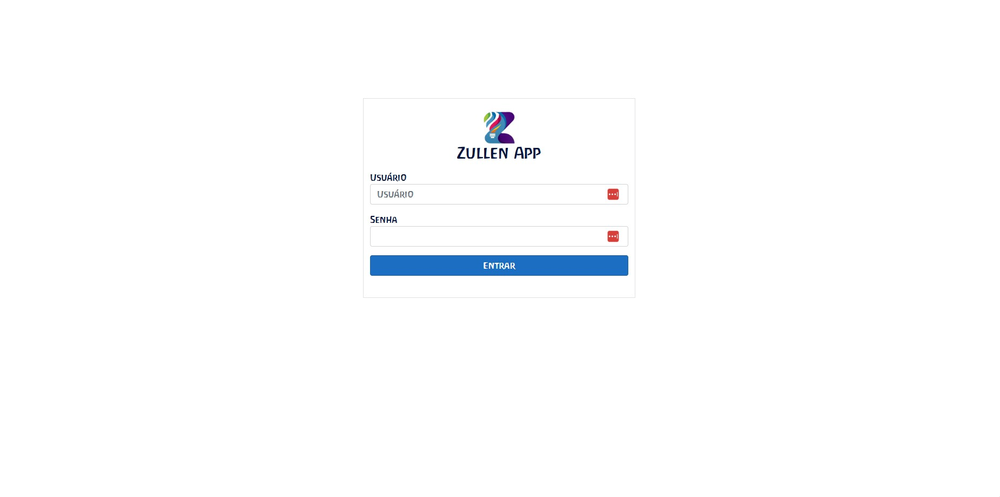

# zullen-fullstack-project
<h3>Projeto Fullstack (CRUD) para um contraturno escolar feito em .NET, Angular e, posteriormente, em Blazor. (repositório privado)</h3>

Primeiramente, busquei ver as necessidades da usuária do sistema e quais informações seriam mais relevantes para armazenar. Com isso, pude definir meu Modelo/Classe/Entidade e suas propriedades.

Segui o modelo de uma Classe "Resposta de Serviço" no qual este dados seriam inseridos numa propriedade "Dados", acompanhados de uma descrição booleana "Sucesso" para indicar o status das operações e os detalhes em uma string "Mensagem". 

Com os Modelos definidos, criei o Contexto do Banco de Dados usando o Entity Framework, configurei a conexão com o Banco de Dados (SQL Server) no appsettings.json adicionando os devidos serviços em Program.cs e realizei as migrações.

A próxima etapa foi a criação dos Endpoints através de um Serviço e do Controlador e suas respectivas lógicas.

Para o Frontend inicial utilizei Angular.

Esta foi a primeira etapa do denvolvimento.

   

<h3>Transferência do Frontend para Blazor, criação de um novo Model e Banco de Dados para os afazeres e criação do sistema de autenticação/autorização</h3>

Utilizei fontes e cores condizentes com o logo da empresa buscando harmonizar o design da interface. Nesta etapa, o produto está como segue rodando em Docker Containers.

<h3>A próxima etapa será implementar uma área de agendamento de vagas para o contraturno</h3>

Na fase presente, estou na etapa de pesquisa de maneiras de implementar o caledário e também as modificações que precisarei no Model para atender as necessidades da aplicação.

A princípio vou precisar:
    - adicionar uma propriedade booleana (ativo/inativo) para os clientes para saber quais mostrar no calendário.
    - modificar a propriedade "Dias/semana" de um int para um Enum com as opções de segunda a sexta-feira, com a possibilidade de armazenar mais de um valor ou dia.
    - implementar a lógica para mostrar as crianças no período e dias corretos dentro do calendário.

